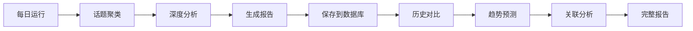

# 历史数据与趋势分析功能

TrendFinder v3.0 引入了完整的历史数据存储和趋势分析能力。

## 新增功能

### 1. 历史数据存储

使用 SQLite 数据库自动保存每日报告数据：

- **每日报告** (`daily_reports`): 总体统计信息
- **每日内容** (`daily_stories`): 详细的内容记录
- **每日话题** (`daily_topics`): 话题聚类结果
- **趋势话题** (`trending_topics`): 话题热度追踪
- **账号活跃度** (`account_activity`): 账号发布活动

数据库位置: `data/trendFinder.db`

### 2. 历史趋势对比

对比当前数据与过去 7/30 天的历史数据：

- **话题趋势**: 识别新增、持续热议和热度下降的话题
- **质量趋势**: 追踪内容质量变化趋势（上升/稳定/下降）
- **账号活跃度**: 发现活跃度显著上升的账号

### 3. 未来趋势预测

基于历史数据使用 AI 预测未来 7 天趋势：

- **潜在新兴话题**: 预测可能出现的新话题（含置信度）
- **话题发展预测**: 预测当前话题的未来走势
- **市场洞察**: AI 生成的机会、风险和建议

### 4. 话题关联分析

分析话题之间的深层关系：

- **关系图谱**: Mermaid 可视化话题关联
- **话题关联**: 识别话题间的因果、并列、包含等关系
- **技术连接点**: 提取跨话题的共同技术/概念
- **跨话题洞察**: 综合多个话题的深层次发现

## 配置

在 `config/report-settings.json` 中启用/禁用功能：

```json
{
  "reportSettings": {
    "enableHistoricalComparison": true,
    "enableTrendPrediction": true,
    "enableRelationshipAnalysis": true
  },
  "historicalSettings": {
    "comparisonDays": 7,
    "longTermDays": 30,
    "predictionDays": 7
  }
}
```

## 报告结构

增强报告现在包含以下章节：

1. **📈 今日概览** - 基本统计和核心趋势
2. **📊 数据可视化** - 主题分布、关键词热度
3. **📊 历史趋势对比** - 话题趋势、质量趋势、活跃账号
4. **🔮 未来趋势预测** - 新兴话题、发展预测、市场洞察
5. **🔗 话题关联分析** - 关系图谱、技术连接、跨话题洞察
6. **📑 专题报告** - 详细的话题分析和核心事件

## 数据积累

- 首次运行后开始积累历史数据
- 7 天后历史对比功能提供更准确的趋势分析
- 30 天后趋势预测将达到最佳效果

## 技术架构

### 模块结构

```
src/services/
├── storage/
│   ├── initDatabase.ts       # SQLite 数据库初始化
│   └── historyStorage.ts     # 历史数据存取
└── analysis/
    ├── historicalComparison.ts  # 历史对比分析
    ├── trendPrediction.ts       # AI 趋势预测
    └── relationshipAnalysis.ts  # 话题关联分析
```

### 数据流



## API

### HistoryStorage

```typescript
const historyStorage = new HistoryStorage();

// 保存每日报告
const reportId = historyStorage.saveDailyReport(stories, topics, avgQualityScore);

// 获取历史数据
const history = historyStorage.getHistoricalData(7); // 最近7天
const trending = historyStorage.getTrendingTopics(30); // 30天热门话题
const activity = historyStorage.getAccountActivity(7); // 账号活跃度

// 关闭连接
historyStorage.close();
```

### HistoricalComparison

```typescript
const comparison = new HistoricalComparison();

// 生成对比分析
const result = await comparison.compare(topics, stories, avgQualityScore);

// 结果包含：
// - trendingTopics: { new, continuing, declining }
// - accountActivity: { mostActive, rising }
// - qualityTrends: { current, average7Days, average30Days, trend }
// - summary: 一句话总结

comparison.close();
```

### TrendPrediction

```typescript
const prediction = new TrendPrediction();

// 生成趋势预测
const result = await prediction.predict(topics, comparisonData);

// 结果包含：
// - emergingTopics: 新兴话题预测（含置信度和推理依据）
// - topicForecasts: 话题发展预测
// - marketInsights: { opportunities, risks, recommendations }
// - summary: 预测总结

prediction.close();
```

### RelationshipAnalysis

```typescript
const analysis = new RelationshipAnalysis();

// 分析话题关联
const result = await analysis.analyze(topics);

// 结果包含：
// - topicRelationships: 话题关联关系
// - technologyConnections: 技术连接点
// - crossTopicInsights: 跨话题洞察
// - relationshipGraph: Mermaid 关系图
```

## 性能优化

- SQLite 事务批量插入数据
- 索引优化查询性能
- AI 调用使用限流（1秒间隔）
- 优雅的错误处理和降级

## 未来计划

- [ ] 导出历史数据为 CSV/JSON
- [ ] 可视化历史趋势图表（多日对比）
- [ ] 更智能的新兴话题预测算法
- [ ] 支持自定义对比时间段
- [ ] 账号影响力评分系统
